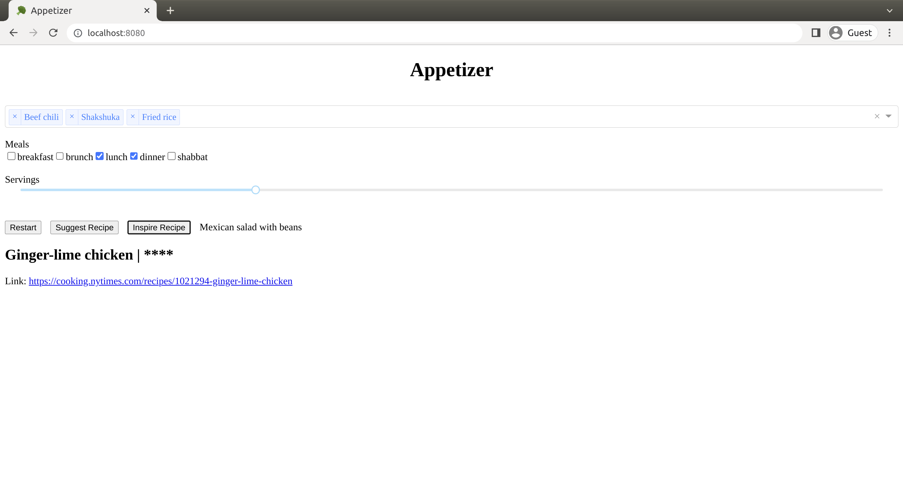

# appetizer
What recipes should we make this week?

## Installation and Use
First, download and install conda. This can be done by installing [Miniconda](https://docs.conda.io/en/latest/miniconda.html).

To download and set up appetizer, run in a terminal:
```
git clone https://github.com/aribrill/appetizer.git
cd appetizer
conda env create -f environment.yml
chmod +x appetizer.sh
```

To run appetizer, run in a terminal:
```
./appetizer.sh
```


